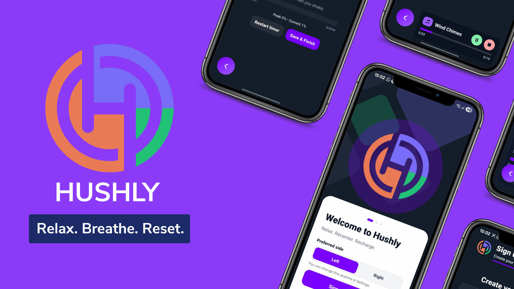
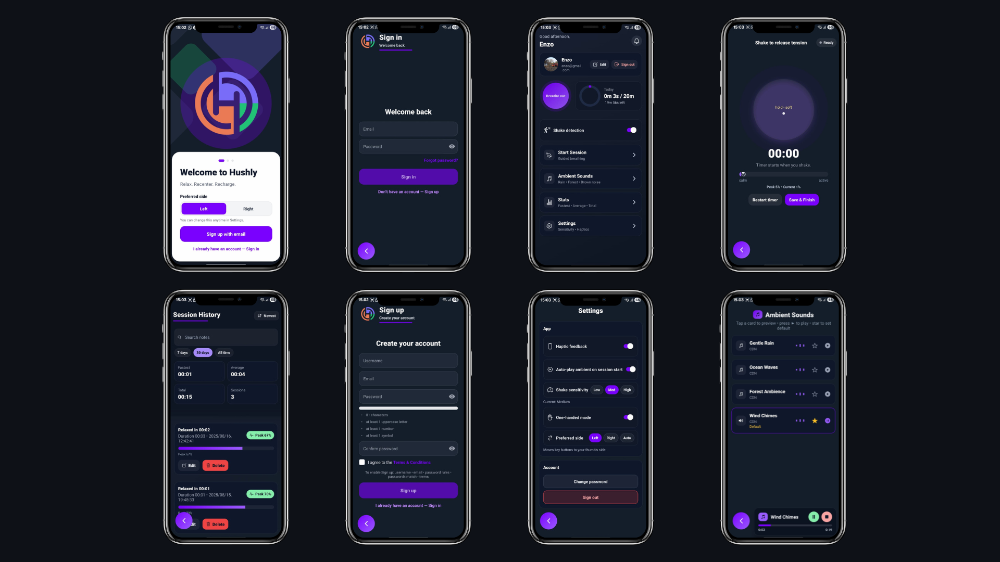

<a id="readme-top"></a>

<!-- Project Shields -->
[](https://expo.dev/)
[](https://reactnative.dev/)
[](https://firebase.google.com/)
[](https://docs.swmansion.com/react-native-reanimated/)
[](LICENSE)

---

# 🌌 Welcome to Hushly – Calm in Your Pocket

**Hushly** isn’t just an app. It’s a pocket-sized sanctuary. Thoughtfully designed using motion, sensors, and mood — Hushly transforms your phone into a calm companion for those moments when the world feels loud.


---

## 💡 What is Hushly?

**Hushly** is a gesture-powered mindfulness app that responds to your movements, gently guiding you into moments of calm using:

- 🎐 Breathe-guided animations
- 🌿 Natural ambient soundscapes
- 🔄 Shake-to-start session activation
- 🧠 Progress tracking with feedback rings
- ✨ Aesthetic design with soft glows and animations

It’s designed for one-handed use, night or day, with minimalist and elegant design language at its core.

---

## 🚧 Built With Love (and Code)

Here's what powers Hushly under the hood:

| Technology       | Version  | Purpose                                |
|------------------|----------|----------------------------------------|
| **Expo**         | 53.0     | Build system / cross-platform support  |
| **React Native** | 0.79     | Core mobile framework                  |
| **TypeScript**   | 5.x      | Strongly typed development             |
| **Firebase**     | v12      | Auth, Firestore, and Storage backend   |
| **Reanimated**   | 3.x      | Beautiful animations                   |
| **Expo Sensors** | latest   | Accelerometer & shake detection        |

---

## ✨ Core Features

- 🔄 **Shake-to-Relax:** Shake your phone to begin a calm session — no taps required.
- 🌬️ **Breathe With the Flow:** Animated inhale-hold-exhale guidance.
- 🌿 **Soothing Soundscapes:** Background audio with nature-inspired themes.
- 🎯 **Focus Mode & One-Hand UX:** Crafted for low-effort interaction, even in stress.
- 👤 **User Profiles & Avatars:** Sync and save data securely with Firebase.
- 📈 **Session Tracking:** See your journey with circular progress rings.

---

## 🎨 Design Philosophy

Hushly was crafted with a clear goal: **simplify serenity**.

- Minimalist but expressive UI
- Low-distraction experience with haptics and soft transitions
- Dark mode by default — light on the eyes and the soul 🌘

---

## 🗂 Project Structure

Here's how the project is structured for clarity and scalability:

```
HUSHLY-MOBILEAPP/
├── android/                    # Android native files
├── assets/                    # Images, audio, and fonts
├── components/                # Reusable UI components
│   ├── FABBack.tsx
│   ├── MiniPlayer.tsx
│   ├── SignInForm.tsx
│   └── SignUpForm.tsx
├── context/                   # Global authentication context
│   └── AuthContext.tsx
├── firebase/                  # Firebase configuration
│   └── firebaseConfig.ts
├── hooks/                     # Custom shake-detection hooks
│   ├── GlobalShakeWatcher.tsx
│   ├── useShakeIntensity.ts
│   └── useShakeToRelax.ts
├── screens/                   # App screens
│   ├── AuthScreen.tsx
│   ├── MainScreen.tsx
│   ├── OnboardingScreen.tsx
│   ├── ProfileScreen.tsx
│   ├── SessionHistoryScreen.tsx
│   ├── SessionScreen.tsx
│   ├── SettingsScreen.tsx
│   ├── SoundsScreen.tsx
│   └── SplashScreen.tsx
├── services/                  # Firebase and app service logic
│   ├── audioManager.ts
│   ├── authService.ts
│   ├── profileService.ts
│   ├── sessionService.ts
│   └── settings.ts
├── styles/                    # Global styling
├── App.tsx                    # App entry point
├── app.json                   # App config
├── .firebaserc, .gitignore, eas.json, babel.config.js
```

---

## ⚙️ How to Run It

1. **Clone the project**:

```bash
git clone https://github.com/your-username/hushly-mobileapp.git
cd hushly-mobileapp
```

2. **Install dependencies**:

```bash
npm install
# or
yarn install
```

3. **Firebase setup**:

Create a file: `firebase/firebaseConfig.ts`:

```ts
import { initializeApp, getApps } from 'firebase/app';
import { getAuth } from 'firebase/auth';
import { getFirestore } from 'firebase/firestore';
import { getStorage } from 'firebase/storage';

const firebaseConfig = {
  apiKey: 'AIzaSy...',
  authDomain: 'hushly-mobile.firebaseapp.com',
  projectId: 'hushly-mobile',
  storageBucket: 'hushly-mobile.appspot.com',
  messagingSenderId: 'XXXXXXX',
  appId: '1:XXXX:web:XXXX',
  measurementId: 'G-XXXXXXX',
};

const app = !getApps().length ? initializeApp(firebaseConfig) : getApps()[0];

export const auth = getAuth(app);
export const db = getFirestore(app);
export const storage = getStorage(app, 'gs://hushly-mobile.appspot.com');
```

4. **Start dev server**:

```bash
npx expo start --tunnel
```

5. **Preview on your device:** Scan the QR with **Expo Go**.

---

## 📸 Screenshots & Mockups

Here’s a peek into the calming UI experience:



---

## 🧠 Creator Log

- 🔧 Used Firebase for real-time data and authentication
- 🔁 Custom shake detection using Expo Accelerometer
- 🎨 Figma-designed UI with animated transitions via Reanimated 3
- 💾 Local preferences and progress storage with AsyncStorage
- 🧪 Tested on Android and iOS
- 💬 Planned for future voice guidance, mood tracking, and background sessions

---

## 🐛 Troubleshooting

- Firebase config error? Re-check API keys and Auth domains.
- App stuck on splash screen? Try `npx expo start -c` to clear cache.
- Shake too sensitive? Adjust threshold in **Settings** screen.

---

## 📄 License

MIT License © 2025 Enzo De Vittorio

---

<p align="center">🌿 Take a breath. You deserve it. 🫶</p>
<p align="center"><a href="#readme-top">⬆ Back to top</a></p>
